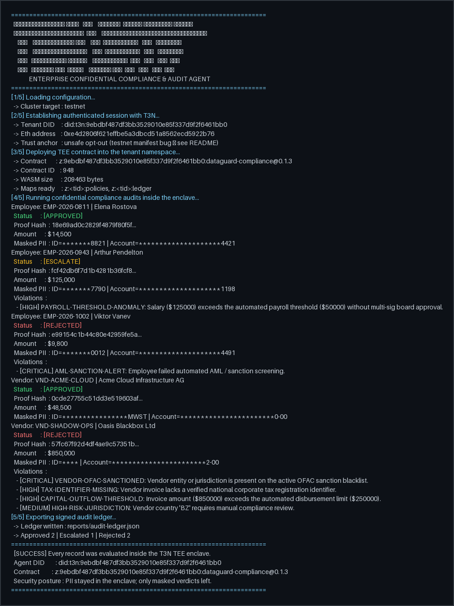

# T3N DataGuard — Confidential Enterprise Compliance & Audit Agent

Enterprise agent on **Terminal 3 (T3N)** that audits payroll records and vendor
invoices **inside the TEE enclave**. Raw PII never leaves the enclave; only
masked verdicts and proof hashes come out.

Built for the T3 enterprise-agent challenge. Focus: **useful + easy to maintain
post-challenge** — one WASM contract, one `src/tenant.ts` for all platform
wiring, policy thresholds tunable without redeploy.

## What it does

- `audit-record` (Rust → WASM, runs in enclave):
  - **Payroll**: threshold anomaly vs tunable limit, AML/sanction flag.
  - **Vendor**: OFAC sanction blacklist, missing tax-ID, capital-outflow limit,
    high-risk jurisdiction → board review.
  - PII masked inside the enclave (national ID `*******8821`, bank `****4421`);
    verdict + proof hash persisted to private `ledger` KV map.
- `src/index.ts` (operator CLI): authenticate → deploy → seed policies → audit
  5 sample records → export `reports/audit-ledger.json`.

Verified live on testnet: 2 APPROVED, 1 ESCALATE_TO_BOARD, 2 REJECTED.
Ledger re-read from chain: attestation entries present, zero raw PII.



## Quickstart (5 min)

```bash
npm install
cp .env.example .env        # fill T3N_API_KEY from https://www.terminal3.io/claim-page
npm run quickstart          # authenticate, print DID
npm run build:contract      # Rust → WASM (needs rustup + wasm32-wasip2)
npm start                   # deploy + audit + export ledger
npm run test:contract       # 16 Rust unit tests (no network)
```

Prereqs: Node 18+, Rust stable + `rustup target add wasm32-wasip2`.

## Layout

- `contract/` — Rust source (`src/lib.rs` entry, `engine.rs` pure rules,
  `policy.rs` threshold resolution), WIT world, build config.
- `src/session.ts` — auth + trust anchor (single place).
- `src/tenant.ts` — maps, registration, invocation (single place).
- `src/index.ts`, `src/data.ts`, `src/types.ts` — CLI, samples, shapes.

## Policy tuning (no redeploy)

Thresholds live in the private `policies` KV map, read per-call by the
contract. Override via `seedPolicies(tenant, {...})`; verified live
(lower salary cap to $5k → record correctly escalates).

## Known platform bugs (filed)

See [`BUG_REPORT.md`](./BUG_REPORT.md):
1. `fetchTrustedManifest("testnet")` rejects the live manifest as malformed —
   workaround: `unsafe_trust_server: true` (testnet only).
2. `contracts.register` rejects same-version redeploy — workaround: auto
   `bumpPatch` in `deployContract`.
3. Map-exists error is lowercase free text — matched case-insensitively.
4. `execute()` on an unregistered tail fails without caller identity or
   function name in the error.

## Maintenance

I will **hand it over** — see [`HANDOVER.md`](./HANDOVER.md) for the 3-step
process (key rotation, one-command redeploy, policy tuning without code).

## License

MIT — see [LICENSE](./LICENSE).
